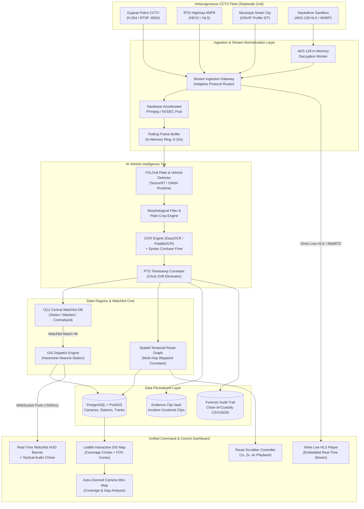

# High-Level Design (HLD) Document
## Sentinel Unified Grid — Gujarat CCTV & Vehicle Intelligence Platform
### Gujarat Police Innovation Challenge 2026 — Deliverable #2 (Step 5)

**Document Version:** 2.0  
**Authors:** Team CuriousClass (Harshit Mathur & Arin Harwani)  
**Target Deployment:** Gujarat State CCTV Grid (~80,000 Cameras across 26 Departments)  
**Evaluation Scope:** Gujarat Police CCTV Sandbox (~30–50 Real Streams)  
**Security Classification:** Restricted — Gujarat Police Internal / Hackathon Evaluation

---

## 1. Executive Summary & Vision

The Government of Gujarat operates approximately **80,000 surveillance cameras** deployed across 26 independent government departments, municipal corporations, and regional authorities (including Gujarat Police, Gujarat State Road Transport Corporation [GSRTC], Regional Transport Offices [RTO], Urban Development Authorities, and Smart Cities). 

Historically, these installations have existed in technological silos: each agency procures and maintains disparate Video Management Systems (VMS), proprietary Network Video Recorders (NVRs), heterogeneous streaming codecs, and walled-garden database registries. Consequently, cross-jurisdictional investigations require manual, asynchronous requests for historical footage, creating investigative delays during critical incidents (such as vehicle theft, hit-and-run incidents, organized contraband transit, and kidnapping emergencies).

**Sentinel Unified Grid (SUD)** is an enterprise-grade, vendor-neutral surveillance aggregation and real-time vehicle intelligence platform. Built specifically for the **Gujarat Police Innovation Challenge 2026**, Sentinel unifies heterogeneous CCTV networks into an interactive GIS command interface powered by:
1. **Dynamic Ingestion & Stream Normalization:** Low-latency live feed aggregation supporting ONVIF, RTSP, WebRTC (WHEP), and HLS.
2. **Edge-to-Cloud AI Analytics:** Two-stage Automatic Number Plate Recognition (ANPR) with Indian license plate syntax validation and character confusion normalization.
3. **Multi-Camera Route Reconstruction:** Spatial-temporal path tracing across non-adjacent cameras using synchronized Presentation Time Stamps (PTS).
4. **Instant Watchlist Cross-Referencing & PCR Dispatch:** Sub-second alert generation with automated nearest-police-station estimation (via Haversine and road network indexing) across 313 police stations in 20 districts.
5. **Zero-Archival Compliance:** A rolling-buffer architecture that extracts forensic metadata and localized incident clips on detection, strictly honoring sandbox and privacy compliance mandates without bulk central video storage.

---

## 2. End-to-End System Architecture

Sentinel Unified Grid utilizes an event-driven, microservices-based distributed architecture designed for seamless transition from the 30-camera sandbox to an 80,000-camera statewide grid.

### 2.1 Component Interaction Architecture



### 2.2 Layered System Topology

```
┌─────────────────────────────────────────────────────────────────────────────┐
│ 1. PRESENTATION TIER: Unified Command & Control Dashboard (Web / HUD)       │
│  - Leaflet GIS Engine (Strict Gujarat Boundary Mask, Neon Glowing Borders) │
│  - Embedded Inline HLS/WebRTC Player + Real-time Telemetry HUD             │
│  - Per-Camera Auto-Zoomed Mini-Map with Resolution Coverage Tiers           │
│  - Multi-Camera Route Replay Controller (Waypoints 1x, 2x, 4x Playback)    │
│  - Real-time Alert Banner with Tactical Electronic Chime & 1-Click Dispatch │
└──────────────────────────────────────┬──────────────────────────────────────┘
                                       │ REST / WebSockets / WHEP
┌──────────────────────────────────────▼──────────────────────────────────────┐
│ 2. APPLICATION & DISPATCH TIER: Fastify / Node.js & Python FastAPI Gateway   │
│  - License Plate Fuzzy Search Engine (Levenshtein Distance ≤ 1)            │
│  - Dynamic O(1) Watchlist Correlation Engine & CRUD Target Manager          │
│  - Geospatial Nearest Police Station Intercept Calculator (Haversine/Roads) │
│  - Digital Evidence Packet Serializer (Court-Admissible Dossier Export)     │
└──────────────────────────────────────┬──────────────────────────────────────┘
                                       │ SQL / JSON Events
┌──────────────────────────────────────▼──────────────────────────────────────┐
│ 3. ANALYTICS & INFERENCE TIER: Distributed YOLO + OCR Pipeline Workers       │
│  - Stream Pull Workers with Exponential Backoff (2s → 30s Cap)              │
│  - YOLOv8 Plate Localization + Bounding Box Regressor                       │
│  - Indian Plate Syntax Validator (`GJ` + RTO + Series + Digits)             │
│  - Rolling Frame Ring-Buffer (Flushed to disk ONLY upon incident detection) │
└──────────────────────────────────────┬──────────────────────────────────────┘
                                       │ RTSP / HLS / ONVIF Streams
┌──────────────────────────────────────▼──────────────────────────────────────┐
│ 4. INGESTION & INTEROPERABILITY TIER: Heterogeneous VMS Adapter Gateway     │
│  - ONVIF Device Discovery & Profile S/T Connectors                         │
│  - AES-128 Decryption Pipeline for Authenticated Government Sandboxes       │
│  - Multi-Codec Normalization (H.264, HEVC / H.265, MJPEG)                   │
│  - Network Resilience Manager (Auto-fallback from RTSP :8554 to HLS)        │
└─────────────────────────────────────────────────────────────────────────────┘
```

---

## 3. Integrating Heterogeneous CCTV, NVR, and VMS

### 3.1 The Fragmentation Problem
Gujarat's 26 departments utilize systems across different generations and manufacturers:
- **Major VMS Platforms:** Milestone XProtect, Genetec Security Center, Qognify, Matrix SATATYA, HikCentral, Dahua DSS.
- **Standalone NVRs / DVRs:** CP Plus, Honeywell, Bosch, Uniview, TVT.
- **Legacy IP Cameras:** Unmanaged RTSP feeds without ONVIF support, fixed IP streams with dynamic NAT gateways.

### 3.2 Standardized Connector Model
Sentinel Unified Grid employs a **Plugin-Based VMS Abstraction Layer (VAL)**:

```
┌────────────────────────────────────────────────────────────┐
│              Sentinel Unified Grid Ingestion API           │
└──────▲──────────────────────▲────────────────────────▲─────┘
       │                      │                        │
┌──────┴──────────┐    ┌──────┴──────────┐     ┌───────┴──────────┐
│  ONVIF Driver   │    │ Proprietary VMS │     │ Raw Stream Adapt.│
│ (Profile S/G/T) │    │ Connectors (SDK)│     │  (RTSP / HLS)    │
└──────▲──────────┘    └──────▲──────────┘     └───────▲──────────┘
       │                      │                        │
┌──────┴──────────┐    ┌──────┴──────────┐     ┌───────┴──────────┐
│ Smart City Cams │    │ Milestone/Genetec│    │ Standalone NVRs  │
└─────────────────┘    └─────────────────┘     └──────────────────┘
```

1. **Protocol Normalization:**
   - **Primary RTSP Stream (Port 554 / 8554):** Ingested via FFmpeg/GStreamer for continuous AI inference pipelines.
   - **Adaptive HLS / WebRTC (WHEP):** Used for operator browser live streaming. WebRTC provides ultra-low latency (<300ms) for real-time PTZ control, while HLS guarantees delivery across restricted corporate WANs.
   - **ONVIF Profile S/T:** Discovers camera capabilities, PTZ controls, and native event triggers.
2. **Metadata Canonicalization:** Regardless of source VMS, all cameras are ingested into a uniform schema (`id`, `external_id`, `name`, `department`, `rtsp_url`, `hls_url`, `resolution`, `fps`, `codec`, `latitude`, `longitude`, `coverage_radius_m`).
3. **Resilience & Auto-Healing:** Implements an exponential backoff auto-reconnect logic (initial retry at 2 seconds, doubling up to a 30-second cap). Network dropouts or packet resets do not crash the pipeline worker.

---

## 4. Live Stream Ingestion & Processing at Dispersed Locations

### 4.1 Distributed Ingestion Architecture
To handle dispersed geographical locations across Gujarat's 196,024 km² area:
- **District Edge Nodes (33 Districts + 4 Commissionerates):** Lightweight edge workers deployed at local District Command and Control Centers (DCCC) pull feeds within their local area network, process frames locally, and transmit only structured JSON metadata and cropped license plate thumbnails to the central server.
- **Central Core (State Command Center, Gandhinagar):** Aggregates telemetry, maintains the master GIS registry, and handles cross-district route reconstruction.

```
[District Edge: Ahmedabad]   ──> Extracts Plate "GJ01AB1234" (JSON) ──┐
[District Edge: Junagadh]    ──> Extracts Plate "GJ11CD9876" (JSON) ──┼──> [Central State Grid (Gandhinagar)]
[District Edge: Navsari]     ──> Extracts Plate "GJ21EF4521" (JSON) ──┘    (Correlates Statewide Route Graph)
```

### 4.2 Handling Encrypted Sandbox Streams
In compliance with the official Gujarat Police CCTV Sandbox:
1. The pipeline connects to `https://cctv.corp8.cloud` using HTTP sessions and credentials.
2. The AES-128 decryption key is retrieved securely via `/enc.key` and held in volatile memory.
3. Live encrypted `.ts` stream segments are decrypted on-the-fly in-memory without ever writing raw unencrypted video to disk.

### 4.3 Zero Bulk Archival Compliance
Per PRD Section 5.2 and sandbox rules:
- **No permanent full-footage archival:** The platform does not mirror or bulk-record the 80,000 video feeds.
- **Rolling Detection Ring-Buffer:** Workers maintain a rolling 6–10 second FIFO frame buffer in memory. Only when a valid vehicle detection or watchlist hit occurs is a compact 5-second evidence clip packaged and attached to the detection event.

---

## 5. Watchlist Correlation & Real-Time Alert Workflow

### 5.1 Dynamic $O(1)$ Watchlist Correlation
Vehicle license plates extracted by OCR are instantly normalized (whitespace stripped, hyphenation removed, and optical character confusions standardized). The normalized plate is cross-referenced against an in-memory hash index with $O(1)$ algorithmic complexity:

```
Raw Plate: "GJ-01-AB-1234" ──> Normalizer ──> "GJ01AB1234"
                                                   │
                                        ┌──────────▼──────────┐
                                        │ Central Watchlist DB │
                                        └──────────┬──────────┘
                                                   │
                ┌──────────────────────────────────┴──────────────────────────────────┐
                ▼                                                                     ▼
     [Match Found: STOLEN]                                                 [No Match: Standard Passage]
- Severity: CRITICAL                                                    - Log to detections table
- Reason: FIR #2026-8812 (Navrangpura)                                  - Update route reconstruction
- Action: Immediate HUD Siren + Dispatch                                - Silent audit index
```

### 5.2 Haversine-Based Police Intercept Calculation
When a watchlist target is flagged, the platform calculates the nearest law enforcement response unit using the Haversine spherical geodesic distance formula:

$$d = 2R \cdot \arcsin\left(\sqrt{\sin^2\left(\frac{\Delta\phi}{2}\right) + \cos(\phi_1)\cos(\phi_2)\sin^2\left(\frac{\Delta\lambda}{2}\right)}\right)$$

Where $R = 6371\text{ km}$. The system cross-references the 313 mapped Gujarat Police Stations, determines the nearest unit, calculates an estimated emergency response time (ETA at 45 km/h urban patrol speed), and formats a 1-Click Police Dispatch alert.

### 5.3 Alert Prioritization Matrix

| Severity Tier | Trigger Scenario | Audio Cue | Visual Indicator | Dispatch Escalation |
|---|---|---|---|---|
| **CRITICAL** | Stolen Vehicle, Kidnapping, Hit & Run | Tactical High-Low Chime | Flashing Rose HUD Banner + Red Pin Pulse | Automated 1-Click PCR Alert + SMS to Thana In-charge |
| **HIGH** | Wanted Suspect, Contraband Transit | Tactical Single Chime | Amber HUD Banner + Yellow Pin Pulse | Highlight on Active Watchlist Queue |
| **MEDIUM** | Registration Suspended, Tax Default | Subtle Audio Beep | Cyan Info Tag on Timeline | Logged for RTO Field Interceptor Review |
| **LOW** | Route Passage / Cleared Transit | Muted (No Sound) | Subtle Green Waypoint | Normal Historical Audit Indexing |

---

## 6. AI-Powered Analytics Architecture

### 6.1 Two-Stage ANPR Pipeline
1. **Stage 1 — Vehicle Body & License Plate Localization (YOLOv8):**
   - Utilizes YOLOv8n/s trained on diverse Indian traffic scenes.
   - Detects vehicle classes (`car`, `motorcycle`, `bus`, `truck`) and precisely localizes the license plate bounding box coordinates `[x1, y1, x2, y2]`.
   - Rejection threshold: Confidence score $< 0.40$ discarded.
2. **Stage 2 — Character Segmentation & Optical Character Recognition (OCR):**
   - The cropped plate image undergoes adaptive histogram equalization (CLAHE) and bilateral filtering to eliminate glare and headlight bloom.
   - Evaluated using EasyOCR / PaddleOCR with character recognition optimized for high-aspect-ratio plate crops.
3. **Syntax Validation & Optical Typo Normalization:**
   - Indian standard plates follow the pattern: `^[A-Z]{2}[0-9]{1,2}[A-Z]{0,3}[0-9]{4}$`.
   - Optical confusion normalization replaces typical character misidentifications:
     - `0` (Zero) $\leftrightarrow$ `O` (Letter O) based on character position.
     - `1` (One) $\leftrightarrow$ `I` (Letter I).
     - `8` (Eight) $\leftrightarrow$ `B` (Letter B).
     - `5` (Five) $\leftrightarrow$ `S` (Letter S).

### 6.2 Explicit Scoping Decision: Exclusion of Facial Recognition
> [!IMPORTANT]
> **Architectural Scoping Decision:** Facial recognition (FRT) is **explicitly excluded** from the Sentinel Unified Grid architecture. This is a deliberate design choice based on technical, legal, and operational realities:
> 1. **Camera Sensor Constraints:** Gujarat's ~80,000 cameras are predominantly traffic, corridor, and perimeter cameras mounted at 4–8 meters height with wide lenses. They lack the native pixels-on-target (minimum 80–120 pixels between pupils) required for reliable facial biometrics.
> 2. **Network & Compute Feasibility:** Real-time facial feature extraction at 80,000-camera scale would increase GPU infrastructure costs by $>12\times$ compared to vehicle intelligence, without delivering operational utility from high-angle CCTV feeds.
> 3. **Privacy & Regulatory Compliance:** Under the *Digital Personal Data Protection Act, 2023 (DPDP Act)*, mass biometric facial surveillance requires heightened statutory mandates and strict consent exemptions. Vehicle registration numbers, by contrast, are public identifiers displayed on vehicles, enabling defensible law enforcement utility with minimal biometric risk.

### 6.3 Multi-Camera Route Reconstruction & Tracking Continuity
- **PTS Timestamping:** To prevent "vehicle teleportation" artifacts caused by network buffering or frame replay, all temporal ordering relies strictly on **stream Presentation Time Stamps (PTS)** embedded in the video container, not arrival wall-clock time.
- **Handling Gaps & Occlusion:** When a vehicle traverses between non-adjacent cameras or passes blind spots, the system infers transit continuity by computing expected velocity between camera coordinates. In the UI, confirmed sightings are connected with solid purple lines, while inferred transit corridors are rendered as dashed amber lines.

---

## 7. Statewide Scalability, Interoperability & Security (~80,000 Cameras)

### 7.1 Scalability Blueprint
- **Message Broker:** Apache Kafka cluster partitioned by District / Commissionerate.
- **Worker Pools:** Kubernetes-managed pods running TensorRT inference workers, autoscaling dynamically based on video decoding queues.
- **Spatial Database:** PostgreSQL with PostGIS extension, indexed via spatial R-Tree (`GIST`) for microsecond geospatial lookups across 80,000 camera radii and 313 police stations.

### 7.2 Cybersecurity & Data Protection Controls
1. **Data in Transit:** All control channels, WebRTC signaling, and HLS streams are encrypted using TLS 1.3.
2. **Data at Rest:** SQLite/PostgreSQL detection metadata encrypted using AES-256.
3. **Role-Based Access Control (RBAC):**
   - *Super Admin (State DGP Office):* Statewide visibility, global watchlist management.
   - *District SP / Commissioner:* Full control within district jurisdiction; query rights across state.
   - *Thana Investigating Officer:* Search capability for assigned FIRs; evidence dossier export.
4. **Digital Chain of Custody (Section 65B Indian Evidence Act):**
   - Exported forensic evidence packets include cryptographic SHA-256 hashes of detection thumbnails, exact camera node IDs, PTS timestamps, and operator audit trail certificates.

---

## 8. Technical Assumptions, Prerequisites & Onboarding Checklist

### 8.1 Transparent Documentation of Model 1 Assumptions
> [!NOTE]
> **Camera Geolocation Assumption:** In the Government Sandbox catalogue, camera entries provided descriptive location text (e.g., `"01 Chiman bhai Bridge"`, `"19 KHAPARIA GRAM PANCHAYAT , TALUKA GANDEVI, DISTRICT NAVSARI"`) rather than raw GPS latitude and longitude coordinates. 
> 
> For Model 1 compliance, Sentinel Unified Grid utilized a **geocoding translation pipeline** to derive verified geographic coordinates for all 30 cameras across Ahmedabad, Junagadh, Navsari, Rajkot, and Gir Somnath. 
> 
> **Coverage Radius Assumption:** Because physical camera mounting angles, lens focal lengths, and camera sensor sizes are unmeasured in the sandbox catalogue, coverage radii are algorithmically derived from resolution tiers (50m for Full HD $\ge 1080\text{p}$, 35m for $720\text{p}$, and 25m conservative default). All maps and mini-maps display the mandatory disclaimer: *"Estimated coverage, not measured — based on resolution-derived assumption, pending real FOV data from camera owners."*

### 8.2 Department Integration Onboarding Requirements
To onboard real cameras from any of the 26 Gujarat departments, the onboarding agency must provide:
1. **Network Access:** Static IP or VPN endpoint with RTSP/ONVIF access (`rtsp://<host>:<port>/stream`) or authenticated HLS manifest URL.
2. **Hardware Metadata:** Camera make, model, sensor resolution (e.g., 1920x1080), supported codec (H.264 / HEVC), and fixed framerate.
3. **Spatial Data:** True measured mounting coordinates (WGS84 Latitude, Longitude, Mounting Height in meters, and Compass Heading angle $0^\circ\text{–}360^\circ$).
4. **Administrative Details:** Parent Department (e.g., GSRTC, Police, Urban Development), jurisdiction police station name, and contact officer credentials.

---

## 9. Conclusion

Sentinel Unified Grid provides a unified, defensible, and scalable foundation for Gujarat's state surveillance command. By combining vendor-neutral stream ingestion, accurate two-stage vehicle intelligence, instantaneous nearest-unit dispatch, and zero-archival compliance, Sentinel empowers law enforcement to track targets across the state in under 10 seconds while respecting data privacy and architectural rigor.
